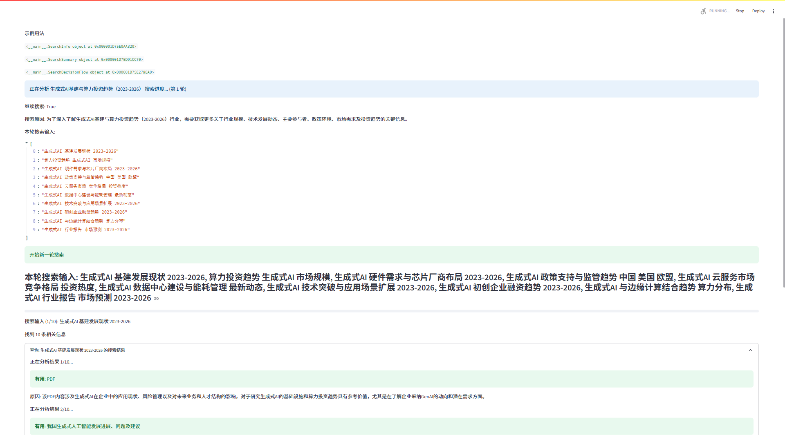
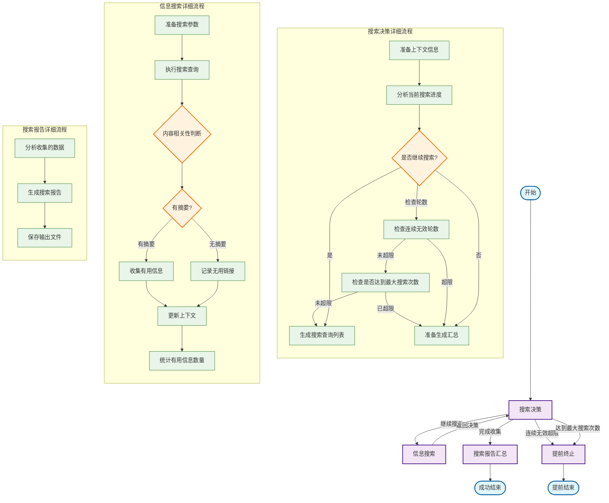

# deepsearch-google

## 快速开始

1. **安装依赖**

   ```bash
   pip install -r requirements.txt
   ```

1. **配置环境变量**

    ```bash
    # .env文件
    OPENAI_API_KEY=your_openai_key
    OPENAI_BASE_URL=https://api.openai.com/v1  # 或者你的代理地址
    OPENAI_MODEL=deepseek-ai/DeepSeek-V3 # 或其他适用模型

    GOOGLE_API_KEY=your_google_api_key
    GOOGLE_ENGINE_ID=your_search_engine_id
    ```

    * **OpenAI API Key**: 可考虑硅基流动等提供兼容API的服务，地址：<https://cloud.siliconflow.cn/i/FcjKykMn>
    * **Google API Key & Engine ID**:
        * 🔑 **GOOGLE_API_KEY**:
            1. 访问 Google Cloud Console，创建项目。
            2. 启用 "Custom Search API"。
            3. 在“凭据”页面创建 API 密钥。
        * 🆔 **GOOGLE_ENGINE_ID**:
            1. 访问 Google 可编程搜索引擎 页面。
            2. 创建新的搜索引擎，配置搜索的网站、语言和名称。
            3. 在控制面板的“基本信息”中找到并复制“搜索引擎 ID”，一般是cx后面的部分。

1. **启动 Streamlit 网页应用**

   ```bash
   streamlit run streamlit_app.py
   ```

1. **命令行批量搜索（可选）**

   ```bash
   python main.py
   ```

---

## 项目简介

本项目是一个基于多轮智能决策的深度行业信息搜索与报告生成工具，支持 Google 搜索、LLM 相关性判别、自动报告输出等。

## 项目截图

<div align="center">
  
  
  
</div>

---

## 工作流程图



## 工作流程说明

### 主流程概述

整个搜索流程包含四个主要节点：

1. **搜索决策** - 分析当前状态，决定下一步行动
2. **信息搜索** - 根据决策执行具体的信息检索
3. **搜索报告汇总** - 整理和生成最终搜索报告（含详细参考文献和搜索时间记录）
4. **提前终止** - 在无效搜索过多、或达到最大搜索次数时提前结束流程

### 详细节点说明

#### 1. 搜索决策节点 (research)

* 分析已收集的信息质量和完整性
* 评估当前搜索进度
* 决定是否需要继续搜索或开始汇总
* 检查无效轮数和总搜索次数，防止无限循环搜索或超出预设搜索量

**输入参数**: industry, context, search_round, invalid_search_rounds, max_invalid_rounds, total_search_count, max_search_count

**输出结果**: continue_search, search_queries

#### 2. 信息搜索节点 (search)

* 执行具体的网络搜索操作（当前使用 Google Search）
* 判断搜索结果的相关性（有摘要才判定，否则直接无用）
* 分类和存储有用信息
* 统计分析本轮有效信息数量
* 累计总搜索次数

**输入参数**: search_queries, industry, useful_links, useless_links, search_pool

**输出结果**: 更新的上下文信息、链接分类、本轮有用信息统计、更新后的 total_search_count

#### 3. 搜索报告汇总节点 (summary)

* 分析所有收集的信息
* 生成结构化的搜索报告
* 报告中包含所有有用搜索结果的详细参考文献（标题、链接、摘要）以及搜索过程中的时间记录
* 保存输出文件

**输入参数**: industry, context, search_round, search_times

**输出结果**: Markdown 格式搜索报告（含参考文献和搜索时间记录）、文件路径

#### 4. 提前终止节点 (early_stop)

* 连续无效搜索轮数 >= 最大允许无效轮数时触发
* 或，总搜索次数 >= 最大允许搜索次数时触发
* 避免无效的重复搜索或超出预算，节省资源
* 可输出部分结果

---

> **参考文献区块说明**：
>
> 生成的搜索报告会自动附带所有有用搜索结果的详细参考文献区块，每条包含标题、原文链接和摘要，便于溯源和查阅。
>
> **搜索时间记录说明**：
>
> 报告中还会包含各主要搜索阶段的时间戳记录。

如需调整提前终止策略，只需修改 `max_invalid_rounds` 或 `max_search_count` 参数即可。

---

### 参数说明与调优指南

下面对三个关键参数做更深入的解读，并给出实战调优建议。

#### 1) 最大搜索轮数 `max_rounds`
- **定义**：限制“搜索轮”的最大次数。一次“轮”包含：生成关键词 → 执行该轮所有关键词检索 → 根据结果返回决策。
- **增长规则**：每完成一轮且仍需继续搜索时，`search_round += 1`。
- **触发终止**：当 `current_round >= max_rounds` 时，流程直接进入“汇总/完成”。
- **使用场景**：控制迭代深度，避免无休止地继续扩展搜索面。

#### 2) 最大搜索次数 `max_search_count`
- **定义**：限制“单条检索请求”的累计总数上限（不同于轮数）。
- **计数规则**：一轮内有多个关键词，每执行一个关键词检索就计数 `+1`；轮末将本轮次数累加到 `total_search_count`。
- **触发终止**：当 `total_search_count >= max_search_count` 时，直接提前结束。
- **使用场景**：硬性控制 API 调用成本与速率，配合配额/预算管理尤为重要。

#### 3) 最大无效轮数 `max_invalid_rounds`
- **定义**：连续出现“本轮没有任何有用结果”的轮数上限。
- **计数规则**：若本轮有用结果数为 0，则 `invalid_search_rounds += 1`；否则将其重置为 0。
- **触发终止**：当 `invalid_search_rounds >= max_invalid_rounds` 时，直接提前结束。
- **使用场景**：防止在噪声很大的主题上“空转”，节省成本与时间。

#### 4) 决策提前结束 `continue_search = False`
- **来源**：由 LLM 在“搜索决策”节点给出（基于现有上下文与目标）。
- **效果**：即使未触达上述阈值，也会立刻转入“汇总/完成”。

---

### 触发顺序与逻辑关系（简化）

决策节点会按如下顺序检查（任一成立即结束）：
- 达到 `max_rounds` → 结束
- 达到 `max_invalid_rounds` → 结束
- 达到 `max_search_count` → 结束
- 否则若 `continue_search = True` → 进入下一轮；为 False → 结束

备注：这三类“硬阈值”是并列的保护；LLM 决策属于“软终止”，用于在信息充分时主动收敛。

---

### 典型配置与调优建议

- **快速摸底（低成本、快）**
  - `max_rounds = 2~3`
  - `max_search_count = 8~15`
  - `max_invalid_rounds = 2`
  - 目标：快速收集高置信度线索，适合初筛。

- **常规研究（平衡成本与覆盖）**
  - `max_rounds = 4~6`
  - `max_search_count = 15~30`
  - `max_invalid_rounds = 2~3`
  - 目标：在合理预算下覆盖更多角度。

- **深度扫描（高覆盖、预算充足）**
  - `max_rounds = 6~10`
  - `max_search_count = 30~60`
  - `max_invalid_rounds = 3`
  - 目标：最大化召回，适合关键课题深研。

调优要点：
- `max_search_count` 是最直接的“成本闸门”；优先根据预算设定它，再设 `max_rounds` 控制深度。
- 对噪声较大或新兴话题，适当调低 `max_invalid_rounds`，避免反复空转。
- 若触发速率限制，可提高关键词间隔时间或降低每轮关键词数量。

---

### 行为示例

- 假设：`max_rounds = 5`、`max_search_count = 18`、`max_invalid_rounds = 2`。
  - 第 1 轮产生 4 个关键词，执行 4 次检索；累计 `total_search_count = 4`。
  - 第 2 轮产生 5 个关键词；执行后累计 `= 9`。
  - 第 3 轮产生 6 个关键词；若全执行则累计 `= 15`。
  - 第 4 轮计划 5 个关键词，但执行到第 3 个时累计达 `18`，立即触发“最大搜索次数”，提前结束。
  - 若某两轮连续没有任何有用结果，则会更早以“最大无效轮数”提前结束。

---

### 观测与排障

- 侧边栏会展示 API 配置状态与搜索池状态；主区域包含“搜索进度”“每轮有用结果统计”等。
- 若你在 IDE 里直接 Debug 运行而非使用 `streamlit run`，`Session State` 将无法正常工作，需改用 `streamlit run` 启动。
